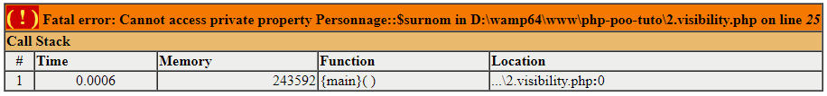

# php-poo-tuto
Learn POO with PHP

# Sommaire

- [Arborescence](#arborescence "Arborescence")
- [La documentation PHP](#la-documentation-php "La documentation PHP")
- [Objet](#objet "Objet")
  - [Le constructor : __construct()](#le-constructor--__construct "Le constructor : __construct()")
  - [Les fonctions](#les-fonctions "Les fonctions")
  - [La visibilité Public / Private / Protected](#la-visibilité-public--private--protected "La visibilité Public / Private / Protected")
- [Le Main](#le-main "Le Main")
  - [Initialisation d'un nouvel objet](#initialisation-dun-nouvel-objet "Initialisation d'un nouvel objet")
  - [Appel des paramètres de l'objet et interactions](#appel-des-paramètres-de-lobjet-et-interactions "Appel des paramètres de l'objet et interactions")
  - [Appel des méthodes](#appel-des-méthodes "Appel des méthodes")

# Arborescence

```
|\index.php
| |
|  \classes
|   |
|   |\classe1.php
|   |\classe2.php
|   |\classe3.php
```

# La documentation PHP

Il est important de documenter son code. Voici les blocs de documentation à ajouter aux fonction, classes, variables dans le code, ainsi que les différents paramètres et attibuts à y ajouter.

```php
```

# Objet

Syntaxe de mon objet. On y retrouve les variables, les fonctions et leur visibilité (public, private, protected)

```php
class Personnage {
  // Propriétés de la classe
  public $vie = 80;
  public $atk = 20;
  public $nom;
  private $surnom;

  public function __construct($name) {
    $this -> nom = $name;
    $this -> surnom = "Mon petit $name";
  }

  public function crier() {
    echo 'LEROY JENKINS';
  }

  public function regenerer($life = null) {
    if(is_null($life)) {
      $this -> vie = 100;      
    } else {
      $this -> vie += $life;
    }
  }

  public function mort() {
    if($this -> vie < 1) {
      $this -> vie = 0;
      return true;
    } else {
      return false;
    }
  }

  public function attaque($cible) {
    $cible -> vie -= $this -> atk;
    $cible -> vie_negative();
  }
}
```

## Le constructor : __construct()

C'est une fonction qui permet de définir les paramètres de l'objet. Ici le nom du personnage.

```php
public function __construct($name) {
  $this -> nom = $name;
}
```

## Les fonctions

Les fonctions définissent les actions qui pourront être faites lors de l'instanciation de mon objet.

### Régénérer mon personnage

Ici, si on ne met pas de paramètre lors de l'appel de la fonction, on régénère entièrement la vie du personnage. En revanche lorsqu'on précise une quantité, on régénère le personnage à hauteur de cette dernière.

```php
public function regenerer($life = null) {
  if(is_null($life)) {
    $this -> vie = 100;      
  } else {
    $this -> vie += $life;
  }
}
```

### Vérifier si mon personnage est mort

Ici, on renvoie _true_ si le personnage est __mort__ et _false_ s'il est en vie.

```php  
public function mort() {
  if($this -> vie < 1) {
    $this -> vie = 0;
    return true;
  } else {
    return false;
  }
}
```

### Attaquer un autre personnage

On attaque un autre personnage. L'attaquant (`$this`) retire en fonction de son __atk__ de la __vie__ au défenseur (`$cible`).

```php
public function attaque($cible) {
  $cible -> vie -= $this -> atk;
}
```

## La visibilité Public / Private / Protected

Une variable __privée__ ne sera pas visible en dehors de la classe. Il en est de meme pour une variable __protected__ (ici la visibilité s'étend aux classe qui hérite de celle courante).  
Pour récupérer les variables __private__ il faut utiliser les __fonctions get__. Pour les modifier il faut utiliser les __fonctions set__.

```php
class Personnage {

  public $vie = 80;
  public $atk = 20;
  public $nom;
  // Variable privée $surnom
  private $surnom;

  // Fonction GET et SET pour récupérer et modifier la variable
  public function getSurnom() {
    return $this -> surnom;
  }

  public function setSurnom($name) {
    $this -> surnom = $name;
  }

  public function attaque($cible) {
    $cible -> vie -= $this -> atk;
    $cible -> vie_negative();
  }

  // La fonction vie_negative() n'est accessible que dans la classe Personnage. 
  // On ne pourra pas l'appeler en dehors.
  private function vie_negative() {
    if ($this -> vie < 0) {
      $this -> vie = 0;
    }
  }

}
```

Appel de la fonction privée via le get
```php
// Récupère la variable privée via la fonction GET
var_dump($merlin -> getSurnom());

// Modifie la variable privée via la fonction SET
$merlin -> setSurnom("Marlin l'Espadon");
```
 
Erreur lors de l'appel d'une fonction privée :



On peut rentre privé les fonctions comme ci dessous. Cela permet de montrer que cette fonction n'est utilisée que dans la classe Personnage et qu'il n'y a pas d'intérêt à la modifier. Elle sera juste appelée dans la fonction concernée (ici `attaque()`).
```php
private function vie_negative() {
  if ($this -> vie < 0) {
    $this -> vie = 0;
  }
}
```

# Le Main

Fichier où sont créés les objets et où sont appelés les différentes méthodes

## Initialisation d'un nouvel objet

```php
$merlin = new Personnage('Merlinn');
$harry = new Personnage('Harryy');
```

## Appel des paramètres de l'objet et interactions

```php
$merlin -> vie = 80;
$merlin -> nom = 'Merlin';

$harry -> vie = 95;
$harry -> nom = 'Harry';
```

## Appel des méthodes

```php
$merlin -> crier();
$merlin -> regenerer(5);

$harry -> regenerer();
$harry -> mort();

$merlin -> attaque($harry);
```

# Exemples

## Mise en place d'un formulaire

### Object

Créer une page `Form.php`. On y retrouve le code ci-dessous :
```php
class Form {
  private $data;
  public $surround = 'p';

  public function __construct($donnees = array()) {
    $this -> data = $donnees;
  }

  private function surround($html) {
    return "<{$this -> surround}>{$html}</{$this -> surround}>";
  }

  private function getValue($index) {
    return isset($this -> data[$index]) ? $this -> data[$index] : null;
  }

  public function input($name) {
    return $this -> surround(
      '<input type="text" name="' . $name . '" value="' . $this -> getValue($name) . '">'
    );
  }

  public function submit() {
    return $this -> surround('<button type="submit">Envoyer</button>');
  }
}
```

### Main

```php
<?php
$form = new Form($_POST);
?>

<form action="#" method=post>
    <?php 
        echo $form -> input('username');
        echo $form -> input('password');
        echo $form -> submit();
    ?> 
</form>
```
